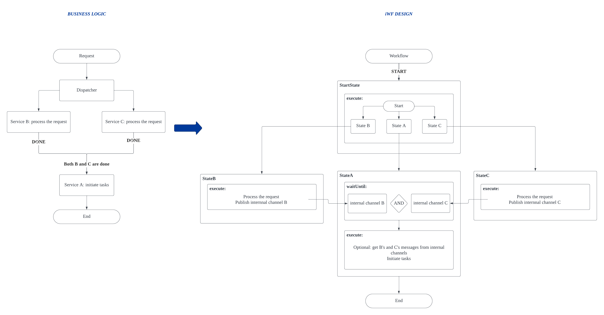
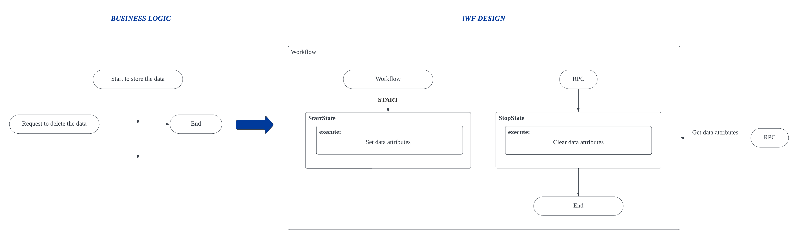

This repository holds several code snippets (also known as mini demos) that demonstrate how to utilize [iWF](https://github.com/indeedeng/iwf) to perform a minimum function.

Various minimum functions can be effortlessly combined to accomplish more intricate tasks, much like assembling several [LEGO](https://www.lego.com) pieces to create an impressive model.

If you are interested in exploring larger demos showcasing such combinations, please refer to [iwf-java-samples](https://github.com/indeedeng/iwf-java-samples).

Here is the list of currently available code snippets, and we are actively working on adding more to it.

- [Interruptible Timer](src/main/java/io/workflow/workflow/interruptibletimer)
  - Implement a timer function to execute actions with delays.
  - Furthermore, this timer is interruptible, enabling the prevention of executing the planned actions when necessary.
    
- [Admin-controlled Failback](src/main/java/io/workflow/workflow/admincontrolledfailback)

  - Automatically re-process the same requests that triggered exceptions once we have fixed the bugs.
    

- [Multiple Task Dependencies](src/main/java/io/workflow/workflow/taskdependency)

  - Service A awaits the results of both Service B and Service C. Only after both B and C have completed their tasks can A initiate its own task.
    

- [Conditional Storage](src/main/java/io/workflow/workflow/conditionalstorage)
  - Only store some data under specific conditions. If the condition is not met, completely delete the data.
    
