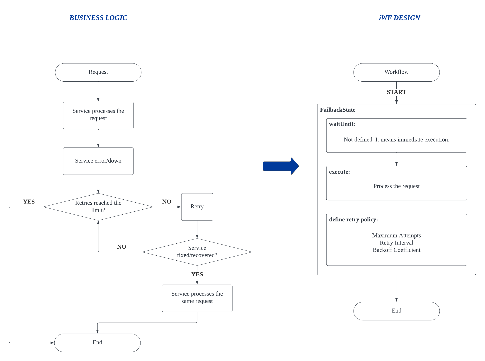

# Use case: Admin-controlled Failback

A service is continuously generating exceptions due to bugs, and as a result, my team needs to re-process the same requests that triggered these exceptions once we have fixed the bugs.
- E.g., consider an email service designed to send mails to new users. It failed to do so because of the exceptions. Our plan is to automatically send the missing emails to the affected users once the service is functioning normally again.

# iWF implementation estimation

Approximately **50** lines of effective codes (See [AdminControlledFailbackWorkflow.java](AdminControlledFailbackWorkflow.java))
- 1 state

# Try it

See [AdminControlledFailbackController.java](../../controller/AdminControlledFailbackController.java)
