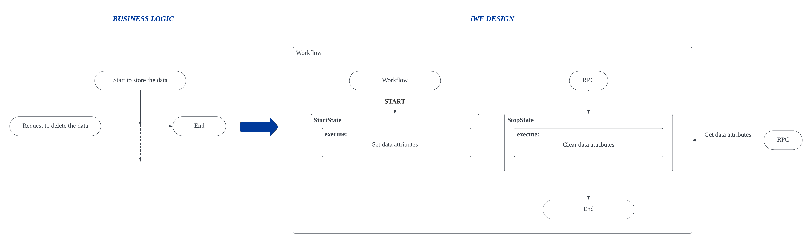

# Use case: Conditional Storage

We only need to store some data under specific conditions. If the condition is not met, we will completely delete the data.

# iWF implementation estimation

Approximately **60** lines of effective codes (See [ConditionalStorageWorkflow.java](ConditionalStorageWorkflow.java))
- 2 states
  - StartState
  - StopState

# Try it

See [ConditionalStorageWorkflowController.java](../../controller/ConditionalStorageWorkflowController.java)
