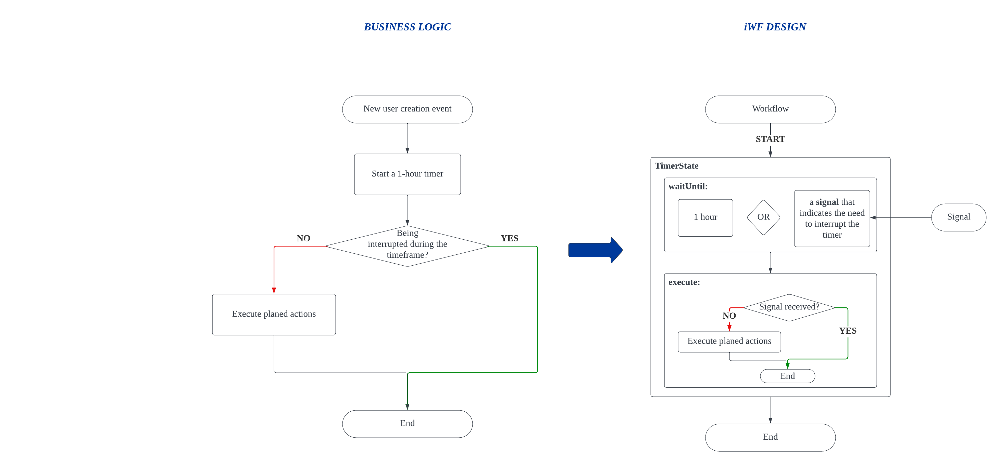

# Use case: Interruptible Timer

My team needs to implement a **timer** function to execute actions with delays. 
- E.g., using it to trigger sending an email to new users after 1 hour to introduce a basic feature to them.

Furthermore, we have an additional request; we would like this timer to be interruptible to prevent executing the planned actions. 
- E.g., we should be able to cancel the email sending plan if users have already experienced the basic feature within the 1-hour timeframe.

# iWF implementation estimation

Approximately **50** lines of effective codes (See [InterruptibleTimerWorkflow.java](InterruptibleTimerWorkflow.java))
- 1 state

# Try it

See [InterruptibleTimerWorkflowController.java](../../controller/InterruptibleTimerWorkflowController.java)
