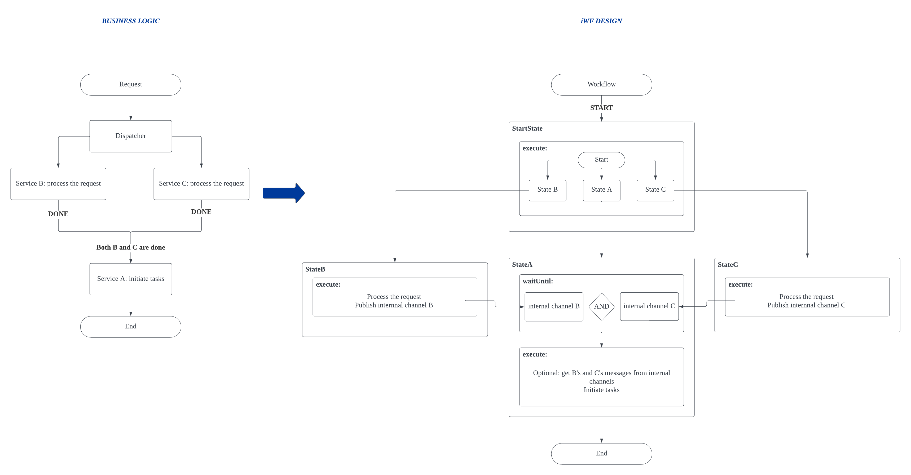

# Use case: Multiple Task Dependencies

Service A must await the results of both Service B and Service C. Only after both B and C have completed their tasks can A initiate its own task.
- E.g., consider a system that receives data sanitize requests from users. It forwards the request to both B and C to sanitize related data. Once both B and C have finished their tasks, Service A will update the status of the request as done.

# iWF implementation estimation

Approximately **120** lines of effective codes (See [TaskDependencyMultipleWorkflow.java](multiple/TaskDependencyMultipleWorkflow.java))
- 4 states
  - StartState
  - StateA
  - StateB
  - StateC

# Try it

See [TaskDependencyController.java](../../controller/TaskDependencyController.java)
